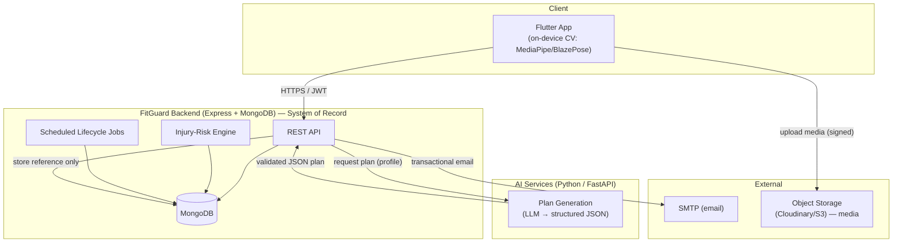

# 01 — System Overview

## 1.1 Vision

FitGuard is an AI-assisted fitness platform whose **distinguishing purpose is
injury prevention**. Conventional fitness apps log workouts or count calories.
FitGuard instead watches *how* an exercise is performed, detects recurring form
mistakes, and quantifies the **cumulative injury risk** those mistakes create over
time — because gym injuries usually result from repeated poor form, not a single
event.

The platform deliberately combines automated intelligence with a **human factor**:
verified coaches can take over a user's planning when AI guidance is not enough
(e.g. users with pre-existing conditions). This satisfies the principle that AI
recommendations must not be the sole authority for at-risk individuals.

## 1.2 Actors

| Actor | Description | Key capabilities |
|-------|-------------|------------------|
| **User (Athlete)** | Any registered account | Onboards, receives AI plans, runs tracked/guided workouts, sees progress & risk, may subscribe to a coach |
| **Coach** | A user approved through verification | Builds & updates plans for subscribers, monitors their progress & risk, publishes profile/transformations |
| **Administrator** | Platform steward | Reviews coach applications, manages users/exercises, oversees integrity — **never edits user progress or risk data** |
| **AI Services** | External subsystem (FastAPI) | (a) generates structured workout/nutrition plans; (b) on-device CV produces rep/mistake events. **Does not** write derived scores |

> *Team note (item 20):* the AI Services subsystem — both the stateless plan service and
> the on-device CV port — is built and owned by a **single AI developer** (see `08 §8.1`).

## 1.3 Service tiers (freemium)

- **Tier 1 — Free AI:** every user automatically gets AI workout + nutrition plans,
  the CV trainer, progress tracking, and injury-risk monitoring. This is the full
  product on its own.
- **Tier 2 — Coach subscription:** optional monthly subscription to a verified
  coach who supervises asynchronously (no live sessions, no calls). While active,
  **coach-authored plans replace AI plans**. On expiry the user reverts to AI plans
  or subscribes again.

## 1.4 Scope boundaries (explicitly excluded)

These are out of scope **by design** and should be stated in the defense as
deliberate scoping, not omissions:

- Medical diagnosis
- Live trainer sessions / video calls / real-time human intervention
- Appointment booking, messaging/chat
- Food logging, calorie/meal tracking, nutrition diary
- Wearable-device integration
- Real payment processing (a **mock** billing record is kept so the freemium cycle
  is complete — see ADR-008)

## 1.5 High-level architecture (C4 — context)

**Key idea:** the Flutter app runs the CV model locally and reports *events*; the
backend validates, stores, and is the only component that computes longitudinal
risk. The AI service is a stateless plan generator the backend calls.

## 1.6 Technology stack

| Layer | Choice | Notes |
|-------|--------|-------|
| Backend runtime | Node.js ≥18, Express 4 | Already in place |
| Database | MongoDB + Mongoose 8 | Document model fits embedded plans/sessions |
| Auth | JWT (access) + refresh tokens | Refresh added in `07` (ADR-009) |
| Validation | zod | Replaces ad-hoc manual checks (ADR-010) |
| API docs | OpenAPI + Swagger UI | Already in place; keep authoritative |
| AI service | Python + FastAPI | Owned by AI team; LLM for plan-gen |
| On-device CV | MediaPipe / BlazePose in Flutter | Owned by AI team |
| Media | Cloudinary or S3 | DB stores references only |
| Email | Nodemailer + SMTP | Already in place |
| Deploy | Fly.io (backend) | Already initialized |

## 1.7 Architecture Decision Records (ADRs)

Each decision below is recorded so the design is traceable during evaluation.

| ID | Decision | Rationale | Consequence |
|----|----------|-----------|-------------|
| **ADR-001** | Keep Express + MongoDB | Foundation is clean; rewriting (NestJS/Postgres) would burn the timeline for marginal gain | Build on the existing layering |
| **ADR-002** | AI and CV live in a **separate FastAPI service**; backend never trains models | Clean micro-service boundary; easy to reason about and defend | Backend integrates via HTTP (plans) and event ingestion (CV) |
| **ADR-003** | **CV runs on-device**; phone reports rep/mistake **events**, not video | Server-side WebSocket streaming was laggy; on-device works offline and is realistic for a mobile app | Trust handled by ADR-004 |
| **ADR-004** | The **backend owns all derived scoring** (accuracy trends, injury risk). The client may never POST a risk score | Removes the "client grades itself" trust hole | Sessions are user-attested *raw events*; risk is recomputed server-side |
| **ADR-005** | **Structured plans** (days → exercises → sets/reps/intensity; calories + macros + meals), not `[String]` arrays | Enables the execution flow, coach edits, and meaningful AI output | Replaces current `PlanAssignment.workoutPlan: [String]` |
| **ADR-006** | **One active plan source**, tracked by `User.activePlanId` + a lifecycle job | Current code lets AI and coach plans both be "active"; expiry never reverts plans | Deterministic plan ownership |
| **ADR-007** | AI plan-gen = **LLM returning schema-validated JSON**, with a deterministic fallback | Personalized and impressive, but safe against malformed/hallucinated output | Backend validates every field before storing |
| **ADR-008** | Subscriptions create a **mock `Payment` record** (provider = `"mock"`) | Completes the freemium cycle without a real gateway (out of scope) | Defensible "payment exists, gateway stubbed" |
| **ADR-009** | Add **refresh tokens** + short-lived access tokens | 7-day non-revocable JWT is a security weakness | Token-rotation flow in `07` |
| **ADR-010** | Centralize **request validation with zod** | Manual per-controller checks are inconsistent | Uniform 422 error shape |
| **ADR-011** | Standardize the role term to **`coach`** | Code stores `"trainer"` aliased to `coach` — confusing | Migration note in `02`; pick one term |
| **ADR-012** | New entities: `CoachProfile`, `Review`, `Transformation`, `Notification`, `MediaAsset`, `MistakeCategory`, `InjuryRiskProfile` | The proposal describes these but they are unmodeled | Detailed in `02` |
| **ADR-013** | A `WorkoutSession` represents a **whole training session** containing per-exercise efforts | Current per-exercise model can't express "completed workouts / consistency" | Restructured in `02` |
| **ADR-014** | **One system of record = this Express + MongoDB backend.** The AI team's two FastAPI + Postgres backends are retired; their FastAPI becomes a **stateless plan-generation service** (no DB) | The team was building parallel MongoDB and Postgres persistence for the same domain — two divergent databases | AI service holds no users/sessions; only plan-gen logic is reused. See `04` + `08` |
| **ADR-015** | An exercise is **`tracked`** iff a validated CV processor exists for it — **not** by free-weight vs machine | The CV team already tracks two machines (`leg_press_machine`, `chest_press_machine`); the original "machines = guided" rule contradicts the working code | `Exercise.type` is driven by `trackedKey` having a processor; genuinely un-trackable movements stay `guided` |
| **ADR-016** | **Food image analysis is out of scope** (cut). Only AI nutrition *plan* generation is kept | Proposal excludes food logging/tracking; the AI team's GPT-4o/Cohere food analysis violates that boundary | AI service exposes plan-gen only; food-analysis code is not integrated |
