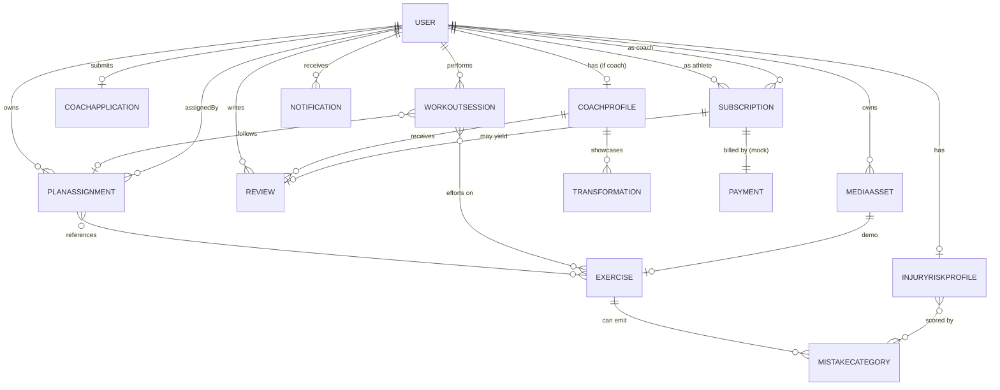

# 02 — Domain Model

This document defines every entity, how they relate, and the full schema for each.
Schemas are written in **Mongoose-flavored pseudo-schema** so they map directly to
the existing backend. Fields marked 🆕 are new vs the current code; ♻️ marks a
changed field.

## 2.1 Entity-relationship diagram



## 2.2 Collections overview

| Collection | Purpose | New? |
|------------|---------|------|
| `User` | Account + onboarding profile | exists (extended) |
| `CoachProfile` | Public coach data (split off the application) | 🆕 |
| `CoachApplication` | Verification submission + decision | exists (extended) |
| `Subscription` | Athlete↔coach monthly subscription | exists |
| `Payment` | Mock billing record per subscription | 🆕 |
| `Exercise` | Catalog (tracked/guided) + CV vocabulary | exists (extended) |
| `MistakeCategory` | Canonical form-mistake taxonomy + risk weights | 🆕 |
| `PlanAssignment` | The active/historical structured plan envelope | exists (restructured) |
| `WorkoutSession` | A whole training session with per-exercise efforts | exists (restructured) |
| `InjuryRiskProfile` | Current derived risk per user | 🆕 |
| `InjuryRiskSnapshot` | Time-series of risk for trend charts | 🆕 |
| `Review` | Athlete review of a coach | 🆕 |
| `Transformation` | Coach before/after showcase | 🆕 |
| `Notification` | In-app + email notification record | 🆕 |
| `MediaAsset` | External media reference (no binary in DB) | 🆕 |

---

## 2.3 User

```js
User {
  email:        String,  // required, unique, lowercase
  passwordHash: String,  // required, select:false
  role:         enum["user","coach","admin"],  // ♻️ "coach" replaces "trainer" (ADR-011)

  profile: {                       // embedded; populated during onboarding
    name:              String,
    age:               Number,     // 8..110
    gender:            enum["Male","Female"],
    heightCm:          Number,     // 80..260
    weightKg:          Number,     // 20..350
    goal:              enum["Weight Loss","Muscle Building","Improve Fitness","Maintain"],
    experienceLevel:   enum["Beginner","Intermediate","Advanced"],   // 🆕 drives workout plan
    daysPerWeek:       Number,     // 🆕 1..7 — desired training days/week (drives workout plan)
    activityLevel:     enum["Sedentary","Light","Moderate","Active","Very Active"], // drives nutrition calc
    mealsPerDay:       Number,     // 1..12
    dietaryPreference: enum["No restriction","Vegetarian","Vegan","Pescatarian","Low-carb"],
    limitations:       [enum["Knee","Shoulder","Lower back","Wrist","Elbow","Hip","Neck"]], // 🆕 safety + AI constraint
    foodDislikes:      String,
    healthConditions:  String,
    allergies:         String
  },

  onboardingCompletedAt: Date,     // 🆕 null until profile complete
  disclaimerAcceptedAt:  Date,     // 🆕 required by proposal; gate onboarding completion

  activePlanId:          ObjectId<PlanAssignment>, // 🆕 single source of truth (ADR-006)
  activeSubscriptionId:  ObjectId<Subscription>,   // 🆕 null when on AI tier

  emailVerifiedAt:          Date,
  emailVerificationToken:   String,  // select:false
  emailVerificationTokenExpiresAt: Date, // 🆕 select:false (C6 — verification token expiry)
  resetToken:               String,  // select:false
  resetTokenExpiresAt:      Date,    // select:false
  refreshTokenHash:         String,  // 🆕 select:false (ADR-009)
  disabledAt:               Date,    // 🆕 soft-deactivation (ban / self-delete) — blocks login + tokens

  timestamps: true
}
```

**Notes**
- `limitations` is important academically: it feeds AI plan constraints and biases
  the injury-risk engine (a user with "Knee" limitation gets earlier knee-risk
  alerts). It is the data backbone of the "human factor for at-risk users" point.
- `disclaimerAcceptedAt` makes the required disclaimer auditable.
- Onboarding is "complete" only when all required profile fields **and**
  `disclaimerAcceptedAt` are set.

## 2.4 CoachProfile  🆕

Split from `CoachApplication` so public-facing coach data is independent of the
application lifecycle. Created/activated when an application is approved.

```js
CoachProfile {
  userId:           ObjectId<User>,  // unique
  bio:              String,          // <=1000
  specialties:      [String],
  certifications:   [{ name:String, issuer:String, mediaId:ObjectId<MediaAsset> }],
  yearsExperience:  Number,
  areasOfExpertise: [String],        // e.g. "Rehab", "Strength", "Weight loss"
  profileImageId:   ObjectId<MediaAsset>,

  // denormalized for the directory listing
  ratingAvg:        Number,   // 0..5, default 0
  ratingCount:      Number,   // default 0

  isPublic:         Boolean,  // true only while role==coach and approved
  timestamps: true
}
```

## 2.5 CoachApplication  (extended)

```js
CoachApplication {
  userId:            ObjectId<User>,   // see index note below
  status:            enum["pending","approved","rejected"],
  bio:               String,
  specialties:       [String],
  yearsExperience:   Number,                 // 🆕
  governmentIdMediaId: ObjectId<MediaAsset>, // 🆕 verification doc
  certificationMediaIds: [ObjectId<MediaAsset>], // 🆕
  applicantNote:     String,                 // 🆕
  decisionNote:      String,
  reviewedBy:        ObjectId<User>,
  reviewedAt:        Date,
  timestamps: true
}
```

**Index (item 4):** use a **partial unique index** on `userId` **where `status == "pending"`** —
a user may hold only **one pending** application at a time, but **may re-apply after a
rejection**. Do **not** put a plain unique index on `userId`.

**On approval (admin):** set `User.role = "coach"`, create/activate `CoachProfile`
(copying bio/specialties/certs), emit `coach_approved` notification.
**On rejection:** keep `role = "user"`, emit `coach_rejected` with `decisionNote`.

## 2.6 Subscription  (exists)

```js
Subscription {
  userId:      ObjectId<User>,   // athlete
  coachId:     ObjectId<User>,   // role==coach
  paymentId:   ObjectId<Payment>, // 🆕
  startDate:   Date,
  endDate:     Date,             // startDate + 1 month
  status:      enum["active","cancelled","expired"],
  cancelledAt: Date,
  timestamps: true
}
```

**Invariant:** at most one `active` subscription per athlete where `endDate > now`.
Status→`expired` is set by the lifecycle job (see `06`), not lazily at read time.

## 2.7 Payment  🆕 (mock)

```js
Payment {
  userId:         ObjectId<User>,
  subscriptionId: ObjectId<Subscription>,
  amountCents:    Number,
  currency:       String,         // "USD"
  status:         enum["succeeded","failed","refunded"],
  provider:       String,         // "mock"
  providerRef:    String,         // generated id, e.g. "mock_xxx"
  timestamps: true
}
```

Defensible statement: *"Billing is modeled end-to-end; a real gateway (Stripe) is a
drop-in replacement at the `provider` boundary and is out of scope."*

## 2.8 Exercise  (extended)

```js
Exercise {
  name:         String,
  type:         enum["tracked","guided"],
  category:     String,          // 🆕 e.g. "Legs","Push","Pull","Core"
  muscleGroups: [String],        // 🆕
  instructions: String,
  demoMediaId:  ObjectId<MediaAsset>, // 🆕 video/gif

  // tracked-only — the shared vocabulary with the CV model
  trackedKey:       String,      // 🆕 machine id, e.g. "squat","bicep_curl","shoulder_press"
  supportedMistakes:[String],    // 🆕 MistakeCategory.key values this exercise can emit
  cvThresholds:     Mixed,       // 🆕 per-exercise CV tuning (angles/limits), seeded from
                                 //    AI/configs/exercise_config.py; served by GET /exercises/cv-config

  isActive:     Boolean,
  timestamps: true
}
```

`trackedKey` + `supportedMistakes` are the **contract between the CV model and the
backend**: the on-device model must emit only `mistake.categoryKey` values listed
here for that exercise. See `04`.

## 2.9 MistakeCategory  🆕

The canonical taxonomy of form mistakes. Owns the **severity weight** that feeds the
injury-risk engine and the corrective cue shown to the user.

```js
MistakeCategory {
  key:            String,   // unique, e.g. "knee_valgus"
  label:          String,   // "Knees collapsing inward"
  appliesTo:      [String], // Exercise.trackedKey values, e.g. ["squat"]
  bodyRegion:     enum["Knee","Shoulder","Lower back","Wrist","Elbow","Hip","Neck"],
  severityWeight: Number,   // 1..5 — how injury-relevant (feeds risk score)
  correctiveCue:  String,   // "Push your knees out over your toes"
  isActive:       Boolean,
  timestamps: true
}
```

`bodyRegion` links a mistake to `User.profile.limitations`, so a knee-limited user's
`knee_valgus` mistakes are up-weighted in risk.

## 2.10 PlanAssignment  (restructured — ADR-005/006)

The envelope that holds the **structured** active or historical plan for a user.

```js
PlanAssignment {
  userId:     ObjectId<User>,
  source:     enum["ai","coach"],
  assignedBy: ObjectId<User>,   // the user (ai) or the coach
  active:     Boolean,
  version:    Number,           // increments on coach update
  notes:      String,

  // for AI plans — provenance for reproducibility/defense
  generatedBy: { model:String, promptVersion:String, generatedAt:Date }, // 🆕

  workout: {                    // ♻️ structured (was [String])
    weeklySchedule: [{
      dayOfWeek: enum["Mon","Tue","Wed","Thu","Fri","Sat","Sun"],
      focus:     String,        // "Lower body"
      rest:      Boolean,
      items: [{
        exerciseId:   ObjectId<Exercise>,
        exerciseName: String,   // denormalized snapshot
        sets:         Number,
        reps:         String,   // "8-12"
        restSeconds:  Number,
        intensity:    String,   // "RPE 7" / "70% 1RM" / "Bodyweight"
        notes:        String
      }]
    }],
    notes: String
  },

  nutrition: {                  // ♻️ structured (was [String])
    dailyCalories: Number,
    protein_g:     Number,
    carbs_g:       Number,
    fat_g:         Number,
    hydrationLiters: Number,
    mealStructure: [{ meal:String, guidance:String, approxCalories:Number }],
    notes: String
  },

  timestamps: true
}
```

**Ownership rule (ADR-006):** exactly one `PlanAssignment` is active per user and is
pointed to by `User.activePlanId`. When a coach assigns/updates a plan, the AI plan
is deactivated; when a subscription expires, the coach plan is deactivated and the
latest AI plan reactivated (or one is generated). Enforced centrally — never by
ad-hoc `updateMany` in two controllers.

## 2.11 WorkoutSession  (restructured — ADR-013)

A **whole training session** containing one or more exercise efforts. This supports
"completed workouts" and "consistency" metrics that a per-exercise model cannot.

```js
WorkoutSession {
  userId:           ObjectId<User>,
  planAssignmentId: ObjectId<PlanAssignment>, // optional, the plan followed
  dayFocus:         String,        // "Lower body"
  source:           enum["device_cv","manual"], // device_cv=tracked, manual=guided
  status:           enum["in_progress","completed","aborted"],
  startedAt:        Date,
  endedAt:          Date,
  durationSec:      Number,

  efforts: [{                      // one per exercise performed
    exerciseId:   ObjectId<Exercise>,
    exerciseName: String,
    trackedKey:   String,          // null for guided
    tracked:      Boolean,
    setsCompleted:Number,
    totalReps:    Number,
    correctReps:  Number,
    wrongReps:    Number,
    accuracy:     Number,          // derived 0..1, computed server-side
    mistakes:     [{ categoryKey:String, count:Number }]
  }],

  // denormalized session totals (computed server-side, never client-set)
  summary: {
    totalReps:   Number,
    correctReps: Number,
    wrongReps:   Number,
    accuracy:    Number,
    mistakeBreakdown: [{ categoryKey:String, count:Number }]
  },

  timestamps: true
}
```

**Integrity rule:** the client posts only raw `efforts` (reps + mistake events).
The backend computes `accuracy`, `summary`, validates
`correctReps + wrongReps == totalReps` per effort, and rejects any client-supplied
`summary`/`accuracy`/risk field.

**Key resolution (A3):** the phone sends `trackedKey` (e.g. `"bodyweight_squat"`),
**not** the Mongo `exerciseId` — it has no way to know ObjectIds. On submit the backend
resolves `trackedKey → Exercise._id` and stores both. Same rule applies to AI plan
items (`§2.10`): the AI returns `trackedKey`; the backend resolves and snapshots
`exerciseId` + `exerciseName`.

## 2.12 InjuryRiskProfile  🆕  (the thesis — schema only; math in `05`)

Current derived risk per user, recomputed after every completed tracked session.

```js
InjuryRiskProfile {
  userId:    ObjectId<User>,   // unique
  overall:   { score:Number, band:enum["low","moderate","elevated","high"], trend:enum["up","down","flat"] },

  byBodyRegion: [{             // SCORED outputs (formula in 05) — "knees are your risk area"
    region: String, score:Number, band:String, trend:String, lastFlaggedAt:Date
  }],

  // DESCRIPTIVE breakdowns only — NOT independently scored. They explain WHICH
  // exercise/mistake drives a region; `regionBand` mirrors the band of the
  // contributing body region from `byBodyRegion`.
  byExercise: [{
    trackedKey:String, recentMistakeCount:Number, lastSeenAt:Date, regionBand:String
  }],
  byMistakeCategory: [{
    categoryKey:String, recentCount:Number, lastSeenAt:Date, regionBand:String
  }],

  sessionsConsidered: Number,  // window size used
  updatedAt: Date
}
```

**Scored vs descriptive (item 12):** only `overall` and `byBodyRegion` carry computed
`score`/`band`/`trend` (the formula in `05`). `byExercise` and `byMistakeCategory` are
**descriptive** — recent counts + `lastSeenAt` + the contributing region's band — so no
undefined sub-score is implied.

## 2.13 InjuryRiskSnapshot  🆕

Append-only time-series for trend charts ("accuracy/risk over time").

```js
InjuryRiskSnapshot {
  userId:       ObjectId<User>,
  takenAt:      Date,
  overallScore: Number,
  byBodyRegion: [{ region:String, score:Number }],
  accuracy:     Number,        // session-window accuracy at that time
  timestamps: true
}
```

## 2.14 Review  🆕

```js
Review {
  userId:         ObjectId<User>,   // author (athlete)
  coachId:        ObjectId<User>,
  subscriptionId: ObjectId<Subscription>, // the period reviewed; unique per (user,subscription)
  rating:         Number,           // 1..5
  comment:        String,
  isPublic:       Boolean,          // default true
  timestamps: true
}
```

**Rule:** an athlete may review a coach only after having an active/expired
subscription with them; one review per subscription period. Writing a review
recomputes `CoachProfile.ratingAvg/ratingCount`.

**Enforce with a unique compound index** `{ userId, subscriptionId }` (D2) so the
"one review per period" rule holds at the database level, not just in the controller.

## 2.15 Transformation  🆕

```js
Transformation {
  coachId:       ObjectId<User>,
  title:         String,
  description:   String,
  beforeMediaId: ObjectId<MediaAsset>,
  afterMediaId:  ObjectId<MediaAsset>,
  durationWeeks: Number,
  isPublic:      Boolean,
  timestamps: true
}
```

## 2.16 Notification  🆕

```js
Notification {
  userId:    ObjectId<User>,   // recipient
  type:      enum["email_verification","coach_approved","coach_rejected",
                  "subscription_activated","subscription_expiring",
                  "subscription_expired","plan_updated","risk_alert"],
  title:     String,
  body:      String,
  channels:  [enum["email","in_app"]],
  read:      Boolean,          // in-app read state
  readAt:    Date,
  metadata:  Mixed,            // e.g. { coachId, region, score }
  timestamps: true
}
```

`risk_alert` ties the thesis together: when the engine raises a body-region band to
`elevated`/`high`, the user is notified with the corrective cue.

## 2.17 MediaAsset  🆕

DB stores **references only**; binaries live in object storage (ADR / `07`).

```js
MediaAsset {
  ownerId:  ObjectId<User>,
  kind:     enum["profile_image","coach_id_doc","certification",
                 "transformation_before","transformation_after","exercise_demo"],
  url:      String,            // public or signed URL
  provider: String,            // "cloudinary" | "s3"
  publicId: String,            // provider handle for deletion
  mime:     String,
  sizeBytes:Number,
  timestamps: true
}
```

---

## 2.18 Migration notes (from current code)

These are the concrete changes from what is in `backend/src/models` today:

1. **`User.role`**: rename stored value `"trainer"` → `"coach"`. One-time migration:
   `db.users.updateMany({role:"trainer"},{$set:{role:"coach"}})`. Update the `ROLES`
   enum and remove the alias.
2. **`User.profile`**: add `experienceLevel`, `daysPerWeek`, `limitations`,
   `User.disclaimerAcceptedAt`, `onboardingCompletedAt`, `activePlanId`,
   `activeSubscriptionId`, `refreshTokenHash`, `emailVerificationTokenExpiresAt`,
   `disabledAt`.
3. **`PlanAssignment`**: replace `workoutPlan:[String]` / `nutritionPlan:[String]`
   with the structured `workout` / `nutrition` subdocuments + `version`,
   `generatedBy`. (No production data yet → safe to redefine.)
4. **`WorkoutSession`**: move from per-exercise to per-session with `efforts[]` +
   server-computed `summary`. Update `progressController` accordingly.
5. **`Exercise`**: add `trackedKey`, `supportedMistakes`, `cvThresholds`, `category`,
   `muscleGroups`, `demoMediaId`.
6. **`CoachApplication`**: add media + verification fields; introduce `CoachProfile`
   and migrate bio/specialties out of the application at approval time.
7. **New collections**: `Payment`, `MistakeCategory`, `InjuryRiskProfile`,
   `InjuryRiskSnapshot`, `Review`, `Transformation`, `Notification`, `MediaAsset`.

> Because there is no production data yet, all of the above are safe to apply
> directly. Seed data for `Exercise` and `MistakeCategory` is specified in `07`.
