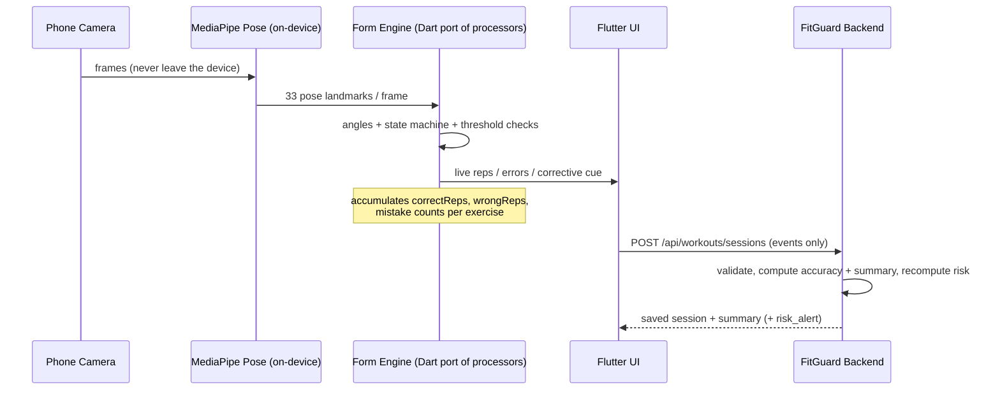

# 04 — AI & Computer-Vision Integration

**Audience:** the AI developer + the Flutter developer.
This is the contract between the AI work and the FitGuard backend. It is written
against your **actual code** in `Fit-Guard-app-main/AI`.

The AI subsystem has exactly **two** responsibilities now:

1. **On-device Computer Vision** — analyze tracked exercises on the phone and report
   rep/mistake **events** to the backend.
2. **Plan generation service** — a stateless FastAPI service that turns a user
   profile into a structured workout/nutrition plan.

Everything else the AI team built (the FastAPI **Postgres** backends under
`Backend/app` and `AI/backend/app`, and the **food image analysis**) is **retired**
— see §4.5. The backend (Express + MongoDB) is the only system of record (ADR-014).

---

## 4.1 The shared CV vocabulary (the most important contract)

The backend stores each tracked exercise with a `trackedKey` and a list of
`supportedMistakes`. **The on-device CV must emit only these keys.** This table is
the single source of truth — it is derived directly from
`AI/configs/exercise_config.py` and the processor `feedback_map`s, and it is the
authoritative **seed** for the `Exercise` and `MistakeCategory` collections.

| `trackedKey` | Processor | `type` | Mistake `categoryKey`s emitted | Body region | Severity (1-5) | Corrective cue |
|---|---|---|---|---|---|---|
| `bicep_curl` | curl | tracked | `elbow_drift` | Elbow | 2 | Pin your elbows to your sides |
| `hammer_curl` | curl | tracked | `elbow_drift` | Elbow | 2 | Pin your elbows to your sides |
| `deadlift` | hinge | tracked | `back_rounding` | Lower back | 5 | Keep your chest up, don't round your back |
| `kettlebell_swing` | hinge | tracked | `back_rounding` | Lower back | 5 | Hinge from the hips, flat back |
| `bodyweight_squat` | squat | tracked | `knee_valgus`, `back_lean`, `insufficient_depth` | Knee / Lower back | 4 / 3 / 1 | Push knees out · Stay upright · Go deeper |
| `leg_press_machine` | squat (machine) | tracked | `insufficient_depth` | Knee | 1 | Control the full range |
| `lunge` | lunge | tracked | `front_knee_lean`, `insufficient_depth` | Knee | 3 / 1 | Keep front shin vertical · Lower fully |
| `pushup` | press | tracked | `hip_sag` | Lower back | 3 | Brace your core, don't let hips sag |
| `chest_press_machine` | press (machine) | tracked | `incomplete_press` | Shoulder | 1 | Press fully, control the return |
| `lat_pulldown` | pull | tracked | `excessive_lean` | Lower back | 3 | Stop swinging, keep your torso still |
| `seated_row` | pull | tracked | `excessive_lean` | Lower back | 3 | Lead with the elbows, torso stable |
| `plank` | hold | tracked | `body_line_deviation` | Lower back | 3 | Keep a straight line, don't drop hips |
| `wall_sit` | hold | tracked | `body_line_deviation` | Knee | 2 | Hold knees near 90°, stay steady |

> **`severity`** feeds the injury-risk engine (`05`). `insufficient_depth` /
> `incomplete_press` are range-of-motion issues, not injuries → low severity. A
> `back_rounding` on a deadlift is the highest injury risk → 5.

**Rule for the CV team:** if you add a new exercise or detect a new mistake, it must
first be added to this table (→ backend seed). The phone must never POST a
`categoryKey` that is not in the exercise's `supportedMistakes`; the backend rejects
unknown keys.

---

## 4.2 Part A — On-device Computer Vision

### 4.2.1 Why we're moving off the server

Today CV runs **server-side**: the phone streams live video over
WebSocket/WebRTC (`streamlit_webrtc`, `websockets`) and the server runs MediaPipe +
OpenCV per frame (`AI/exercises/*_processor.py`). That round-trip is the source of
the lag, costs server CPU, and breaks without connectivity.

**Good news: almost none of your CV logic is a neural network.** The only ML is
**MediaPipe Pose** (landmark detection), which runs natively on-device. Everything
in `base_exercise.py` and the processors is **pure geometry**: joint angles, a
3-state rep machine (`s1` start → `s2` mid → `s3` peak), and the thresholds in
`exercise_config.py`. That ports cleanly to Dart.

### 4.2.2 Target architecture (on-device)



**What runs where:**

| Concern | Where | Source |
|---|---|---|
| Pose landmark detection | On-device (MediaPipe / `google_mlkit_pose_detection`) | replaces server MediaPipe |
| Angle math (`find_angle`, `get_landmark_features`) | Dart port | `AI/utils.py` |
| Rep state machine (s1/s2/s3, rep counting) | Dart port | `base_exercise.py` `process()` |
| Per-exercise form rules | Dart port | each `*_processor.py` `check_form()` |
| Thresholds | **Config, not code** — ship as JSON (see 4.2.3) | `exercise_config.py` |
| Persisting results | Backend only | `POST /api/workouts/sessions` |

### 4.2.3 Thresholds as remote config

Do **not** hardcode thresholds in Dart. Export `EXERCISE_CONFIG` to a JSON file the
backend serves (e.g. `GET /api/exercises/cv-config`) so thresholds can be tuned
without shipping a new app build. Shape:

```json
{
  "bodyweight_squat": {
    "type": "squat",
    "thresholds": { "start_angle": 150, "depth_angle": 75, "error_back_lean": 50, "error_knee_valgus": 0.85 }
  }
}
```

### 4.2.4 The session-submit contract (phone → backend)

After a tracked workout, the phone POSTs **raw events only**. It never sends
`accuracy`, `summary`, or any risk value — the backend derives those (ADR-004).

```http
POST /api/workouts/sessions      (Authorization: Bearer <access token>)
```
```json
{
  "planAssignmentId": "665f...",          // optional: the plan being followed
  "dayFocus": "Lower body",
  "source": "device_cv",
  "startedAt": "2026-06-19T17:00:00Z",
  "endedAt":   "2026-06-19T17:32:00Z",
  "efforts": [
    {
      "trackedKey": "bodyweight_squat",
      "setsCompleted": 3,
      "totalReps": 20,
      "correctReps": 15,                   // == base_exercise.reps
      "wrongReps": 5,                       // == base_exercise.improper_reps
      "mistakes": [
        { "categoryKey": "knee_valgus", "count": 3 },
        { "categoryKey": "back_lean",   "count": 2 }
      ]
    }
  ]
}
```

**Backend validation (rejects the request on any failure):**
- `trackedKey` exists and is an active tracked `Exercise`.
- every `mistakes[].categoryKey` ∈ that exercise's `supportedMistakes`.
- `correctReps + wrongReps == totalReps` per effort.
- no client-supplied `accuracy` / `summary` / risk field is honored.

**Backend response:**
```json
{
  "session": { "id": "…", "summary": { "totalReps": 20, "correctReps": 15, "wrongReps": 5, "accuracy": 0.75, "mistakeBreakdown": [ … ] } },
  "riskAlert": { "region": "Knee", "band": "elevated", "cue": "Push your knees out over your toes" }  // present only if risk crossed a threshold
}
```

### 4.2.5 Guided exercises

Exercises with no processor are `guided`: the app shows `instructions` +
`demoMediaId` and the user taps "mark complete". That posts a session with
`source: "manual"` and an effort with `tracked: false` (no reps/mistakes required).
No CV runs.

### 4.2.6 Migration checklist for the AI + Flutter teams

1. Add `google_mlkit_pose_detection` (or MediaPipe) to the Flutter app; verify 33
   landmarks at ≥15 fps on a mid-range device.
2. Port `utils.find_angle` / `get_landmark_features` to Dart (pure math).
3. Port `base_exercise.process()` (the s1/s2/s3 machine + rep/error counting) to a
   Dart `FormEngine` base class.
4. Port one `check_form()` per processor (curl, hinge, squat, lunge, press, pull,
   hold). Start with `squat` — it's the most complete reference.
5. Load thresholds from `GET /api/exercises/cv-config`.
6. Accumulate `correctReps` / `wrongReps` / `mistakes[]` and submit via
   `POST /api/workouts/sessions`.
7. Delete the WebSocket/WebRTC streaming path (`streamlit_webrtc`, `websockets`,
   `output_live.flv`) — no longer needed.

> The Streamlit pages (`AI/pages`, `AI/dashboard`) remain useful as an **internal
> testing harness** for the CV logic, but they are not part of the shipped product.

---

## 4.3 Part B — Plan generation service (stateless FastAPI)

The backend calls the AI service to generate a plan; the AI service holds **no
database**. Reuse the logic in `AI/services/workout_generator.py`,
`AI/backend/app/services/nutrition_service.py`, and
`workout_planner_service.py` — but expose it as the two stateless endpoints below.

### 4.3.1 Workout plan

```http
POST {AI_SERVICE_URL}/v1/plans/workout      (X-Service-Key: <shared secret>)
```
> The backend sends the **full profile** to both endpoints. The **workout** endpoint
> uses: `goal`, `experienceLevel`, `daysPerWeek`, `limitations` (+ age/gender/height/
> weight for load sanity).

```json
{
  "profile": { "age": 24, "gender": "Male", "heightCm": 178, "weightKg": 82,
               "goal": "Muscle Building", "experienceLevel": "Intermediate",
               "activityLevel": "Moderate", "mealsPerDay": 3,
               "dietaryPreference": "No restriction", "allergies": "", "foodDislikes": "",
               "limitations": ["Knee"], "daysPerWeek": 4 },
  "exerciseCatalog": [                       // ONLY pick from this list — no invented exercises
    { "trackedKey": "bodyweight_squat", "name": "Bodyweight Squat", "type": "tracked", "muscleGroups": ["quads","glutes"] },
    { "trackedKey": "lat_pulldown", "name": "Lat Pulldown", "type": "tracked", "muscleGroups": ["lats"] }
  ]
}
```

**Response** — must match `PlanAssignment.workout` (`02 §2.10`):
```json
{
  "weeklySchedule": [
    { "dayOfWeek": "Mon", "focus": "Lower body", "rest": false,
      "items": [ { "trackedKey": "bodyweight_squat", "sets": 4, "reps": "8-12", "restSeconds": 90, "intensity": "RPE 7", "notes": "" } ] }
  ],
  "notes": "Knee limitation respected: no deep loaded squats."
}
```

### 4.3.2 Nutrition plan

```http
POST {AI_SERVICE_URL}/v1/plans/nutrition    (X-Service-Key: <shared secret>)
```
Request body: `{ "profile": { ...the same full profile object as §4.3.1... } }`. The
**nutrition** endpoint uses: `age`, `gender`, `heightCm`, `weightKg` and
**`activityLevel`** (the Mifflin-St Jeor activity factor), `goal` (deficit/surplus),
`mealsPerDay` (meal count), and `dietaryPreference` / `allergies` / `foodDislikes` (to
honor the diet).

Response matches `PlanAssignment.nutrition`:
```json
{
  "dailyCalories": 2600, "protein_g": 165, "carbs_g": 300, "fat_g": 70,
  "hydrationLiters": 3.0,
  "mealStructure": [ { "meal": "Breakfast", "guidance": "Protein + complex carbs", "approxCalories": 600 } ],
  "notes": "Vegetarian honored."
}
```

### 4.3.3 LLM rules + safety net (ADR-007)

- The LLM (e.g. Groq/OpenAI as the AI team already use) must return **JSON only**,
  conforming to the schemas above. Use the catalog so it can't invent exercises.
- The **backend validates every field with zod** before storing. On malformed
  output, the backend falls back to a **deterministic generator**:
  - Calories: Mifflin-St Jeor × activity factor, adjusted for `goal`.
  - Workout: a template by `goal` + `experienceLevel`, filtered by `limitations`.
- `limitations` is a **hard constraint**: e.g. `Knee` ⇒ avoid deep loaded knee
  flexion; surface this in `notes`. This is the "human-safety" guard professors
  will ask about.
- Store provenance in `PlanAssignment.generatedBy` (`{model, promptVersion}`) for
  reproducibility.

### 4.3.4 How the backend uses it

`POST /api/users/me/ai-plan` (already exists, currently stubbed) will:
1. load the user profile + active exercise catalog,
2. call both AI endpoints,
3. validate → fallback if needed,
4. deactivate the prior AI plan and create a new active `PlanAssignment(source:"ai")`,
5. set `User.activePlanId`.

---

## 4.4 Service configuration

| Env var (backend) | Meaning |
|---|---|
| `AI_SERVICE_URL` | Base URL of the FastAPI plan service |
| `AI_SERVICE_KEY` | Shared secret sent as `X-Service-Key` |
| `AI_SERVICE_TIMEOUT_MS` | Call timeout; on timeout → deterministic fallback |

The AI service validates `X-Service-Key` on every request and exposes
`GET /health`. It is the only inbound surface; it never talks to MongoDB.

---

## 4.5 What the AI team retires (do not build further)

| Item | Why | Action |
|---|---|---|
| `Backend/app` (FastAPI + Postgres) | Duplicate system of record | Delete / archive |
| `AI/backend/app` users/workouts/exercises/plans persistence | Duplicate system of record | Strip to stateless plan-gen only |
| Postgres / `sqlalchemy` / `asyncpg` / `alembic` | No second database | Remove deps |
| Food image analysis (`openai` GPT-4o, `cohere`) | Out of scope (ADR-016) | Remove from product; nutrition *plan* gen stays |
| WebSocket/WebRTC live stream | Replaced by on-device CV | Remove from product (keep Streamlit for internal testing only) |

The net result: the **AI developer** owns **(a)** the on-device form engine (ported to
Dart, co-owned with Flutter) and **(b)** one small stateless FastAPI plan service. Far
less to maintain, and no database to keep in sync with yours.
