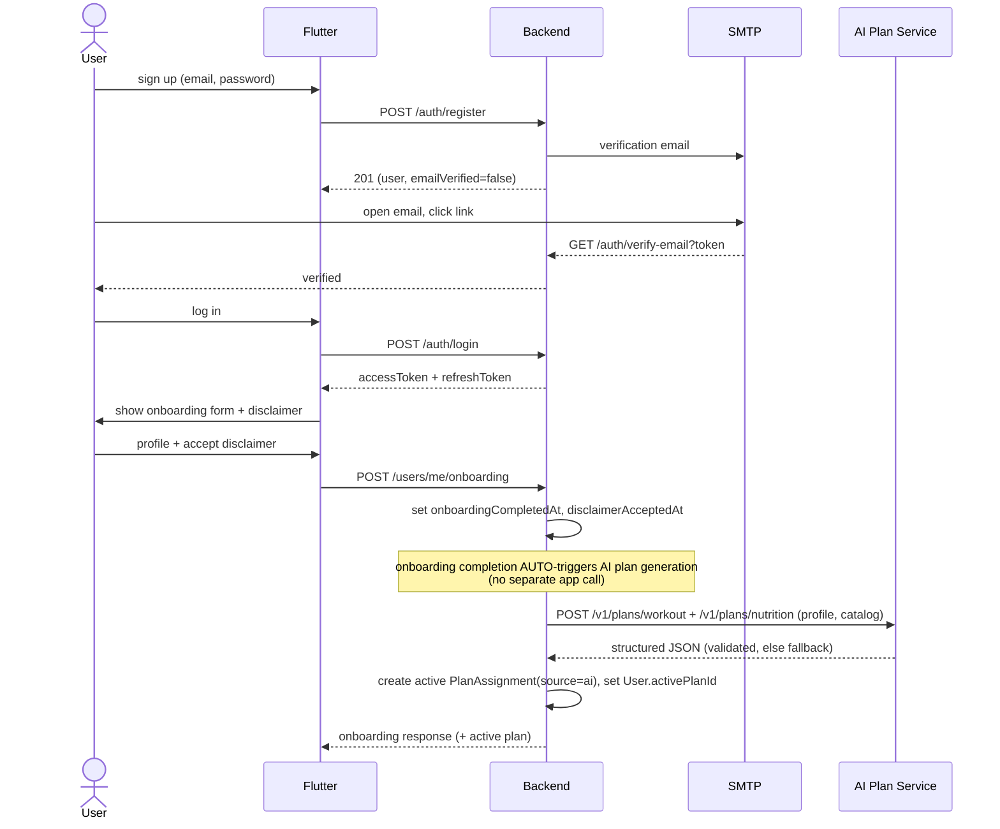
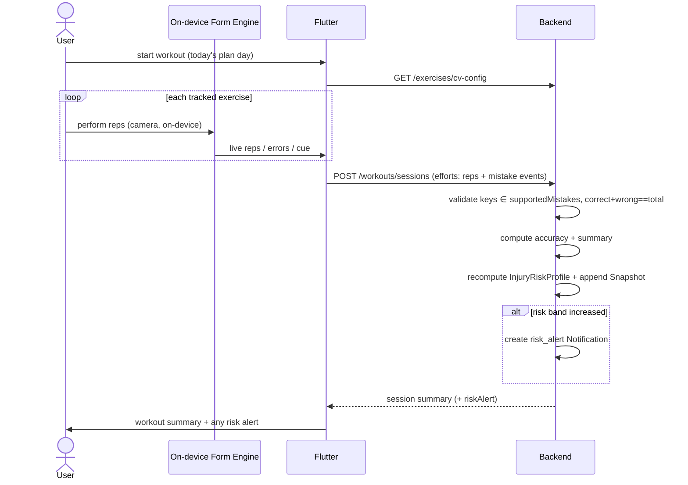
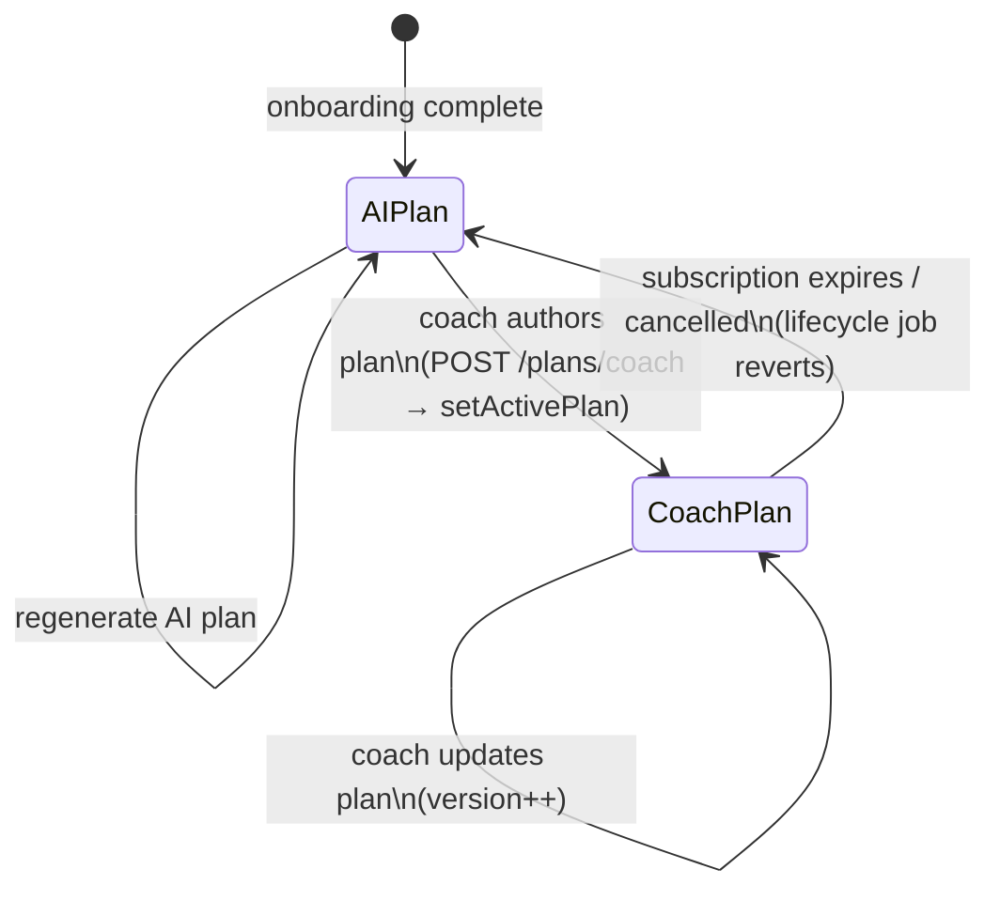
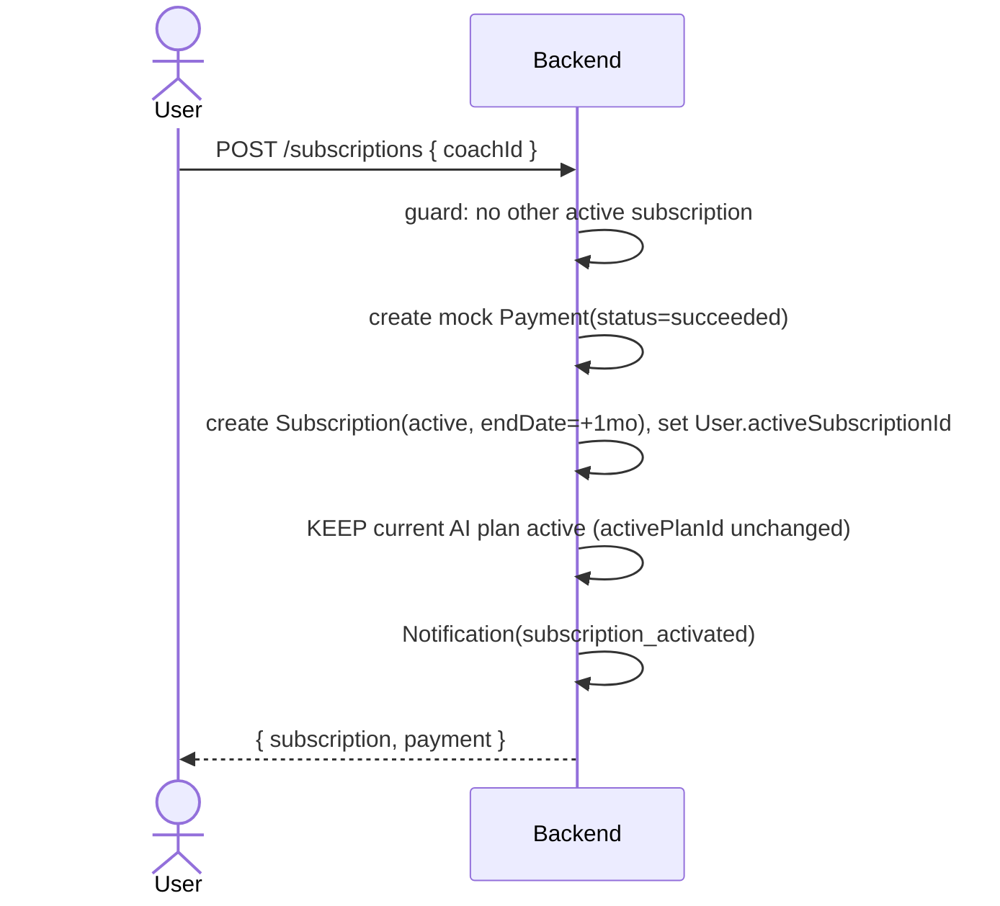
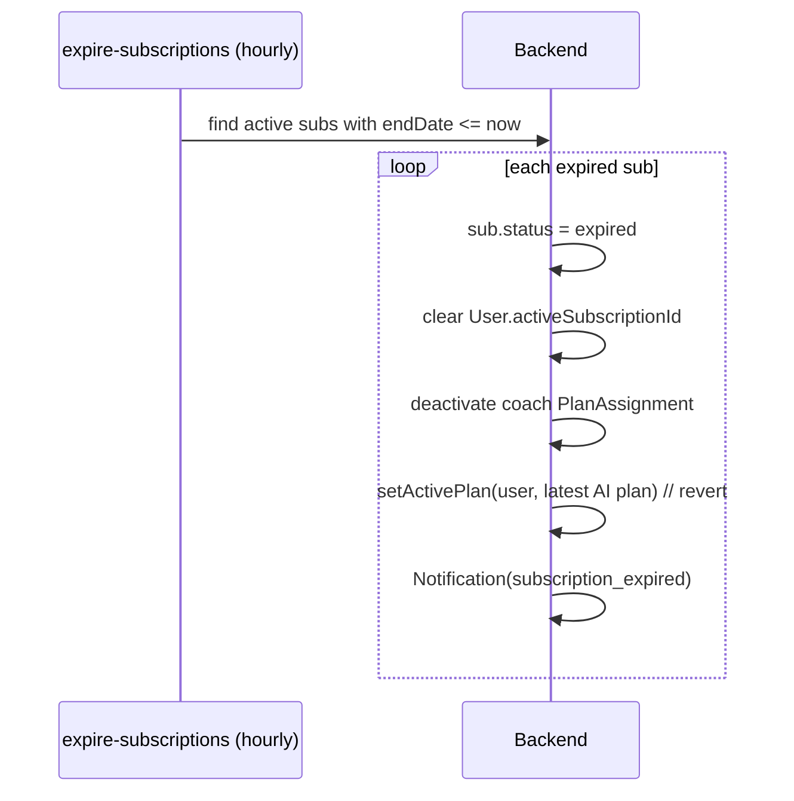
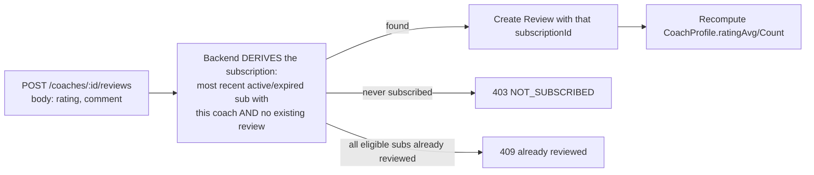

# 06 — Flows & Lifecycle

Sequence diagrams for every cycle, plus the **scheduled jobs** that close the cycles
your current code leaves open (subscription expiry, plan reversion). Diagrams render
on GitHub.

## 6.1 Onboarding: register → verify → onboard → AI plan



**Gate:** the app must not allow workouts until `onboardingCompletedAt` is set. Login
is blocked until email is verified (already enforced).

**AI-plan trigger (item 18):** the backend auto-generates the first AI plan **once**, as
part of onboarding completion. `POST /users/me/ai-plan` is a **manual fallback** the app
calls only when `GET /plans/me` shows no active plan (e.g. generation failed) or when the
user explicitly asks to regenerate.

## 6.2 Tracked workout execution (on-device CV → risk)



Guided exercises skip CV: the app shows instructions/demo and posts a `manual`
session with `tracked:false`.

## 6.3 Plan ownership & subscription lifecycle (the cycle your code breaks today)



**Invariant enforced centrally (ADR-006):** exactly one active `PlanAssignment` per
user, pointed to by `User.activePlanId`. A single service function
`setActivePlan(userId, planId)` deactivates the previous active plan and updates the
pointer atomically — never ad-hoc `updateMany` in two controllers.

### Subscribe flow



**Plan during the subscribe gap (item 7):** subscribing does **not** change the active
plan. The user keeps their **AI plan** until the coach actually authors one via
`POST /plans/coach`, at which point `setActivePlan` swaps `activePlanId` to the coach
plan (and deactivates the AI plan). If the subscription ends before the coach ever
authored a plan, the user was already on the AI plan, so there is nothing to revert.

## 6.4 Scheduled jobs (these fix bugs B2/B3)

Run via a scheduler (`node-cron` in-process, or a Fly.io scheduled machine). All jobs
are **idempotent**.

| Job | Cadence | Action |
|-----|---------|--------|
| **expire-subscriptions** | hourly | For `Subscription` where `status=active && endDate<=now`: set `status=expired`; clear `User.activeSubscriptionId`; deactivate the coach `PlanAssignment`; reactivate the latest AI plan (or generate one if none); `Notification(subscription_expired)` |
| **expiry-reminders** | daily | Subscriptions expiring within 3 days → `Notification(subscription_expiring)` (+ email) |
| **risk-decay (optional)** | nightly | Recompute `InjuryRiskProfile` so risk decays on rest days too |



> Until this job exists, an expired subscriber stays on a stale coach plan forever and
> never reverts to AI — the bug called out in the review (B3).

## 6.5 Coach verification

```mermaid
sequenceDiagram
    actor U as User
    participant BE as Backend
    actor A as Admin
    U->>BE: POST /media (gov ID, certs) → mediaIds
    U->>BE: POST /coaches/applications { bio, specialties, yearsExperience, mediaIds }
    BE->>BE: CoachApplication(status=pending)
    A->>BE: GET /admin/coach-applications?status=pending
    A->>BE: PATCH /admin/coach-applications/:id { decision }
    alt approved
        BE->>BE: User.role=coach; create/activate CoachProfile
        BE->>BE: Notification(coach_approved)
    else rejected
        BE->>BE: keep role=user; Notification(coach_rejected, note)
    end
```

The gov-ID + certifications requirement is the **human-verification** safeguard
(only vetted humans supervise at-risk users) — make this explicit in the defense.

## 6.6 Notification fan-out

A single `notify(userId, type, payload)` service writes a `Notification` (in-app) and,
for the email-worthy types, sends an email. Triggers:

| Type | Trigger |
|------|---------|
| `email_verification` | register |
| `coach_approved` / `coach_rejected` | admin decision |
| `subscription_activated` | subscribe |
| `subscription_expiring` / `subscription_expired` | lifecycle jobs |
| `plan_updated` | coach updates a subscriber's plan |
| `risk_alert` | risk band increases (`05 §5.7`) |

## 6.7 Review eligibility



The client never sends `subscriptionId`; the backend derives it (item 3). One review per
subscription period is enforced by the unique index `{ userId, subscriptionId }`
(`02 §2.14`).
